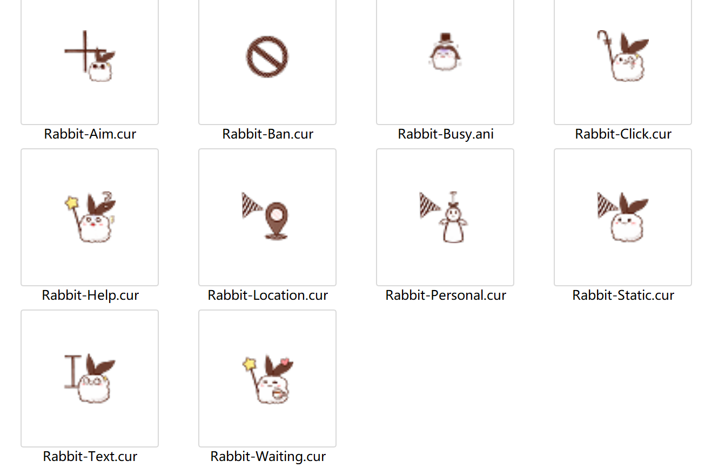

# Coffee-Rabbit-Cursor
这是一套可爱的兔兔鼠标指针主题w(￣▽￣)

# 使用方式
点击Download Zip下载鼠标指针文件压缩包

解压后进入Rabbit-Cursor文件夹，右键单击.inf文件，以安装鼠标指针文件
安装完成后会弹出一个鼠标样式设置框，单击确定

然后就可以啦！

此外，如果使用过程中感觉鼠标指针的箭头过小的话，可以到系统设置中调整鼠标指针的大小~

